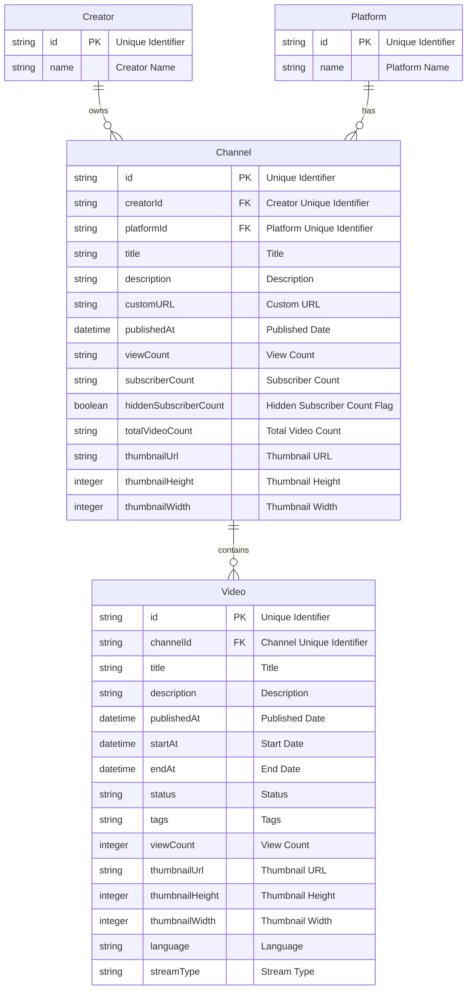

### Common API

- ER Diagram

```mermaid
erDiagram
    Creator ||--o{ Channel : "owns"
    Platform ||--o{ Channel : "has"
    Channel ||--o{ Video : "contains"

    Creator {
        string id PK "Unique Identifier"
        string name "Creator Name"
    }

    Platform {
        string id PK "Unique Identifier"
        string name "Platform Name"
    }

    Channel {
        string id PK "Unique Identifier"
        string creatorId FK "Creator Unique Identifier"
        string platformId FK "Platform Unique Identifier"
        string title "Title"
        string description "Description"
        string customURL "Custom URL"
        datetime publishedAt "Published Date"
        string viewCount "View Count"
        string subscriberCount "Subscriber Count"
        boolean hiddenSubscriberCount "Hidden Subscriber Count Flag"
        string totalVideoCount "Total Video Count"
        string thumbnailUrl "Thumbnail URL"
        integer thumbnailHeight "Thumbnail Height"
        integer thumbnailWidth "Thumbnail Width"
    }

    Video {
        string id PK "Unique Identifier"
        string channelId FK "Channel Unique Identifier"
        string title "Title"
        string description "Description"
        datetime publishedAt "Published Date"
        datetime startAt "Start Date"
        datetime endAt "End Date"
        string status "Status"
        string tags "Tags"
        integer viewCount "View Count"
        string thumbnailUrl "Thumbnail URL"
        integer thumbnailHeight "Thumbnail Height"
        integer thumbnailWidth "Thumbnail Width"
        string language "Language"
        string streamType "Stream Type"
    }

```
