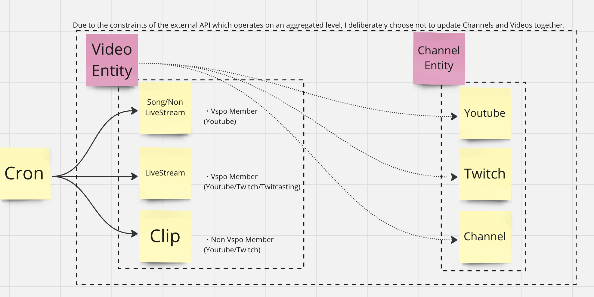
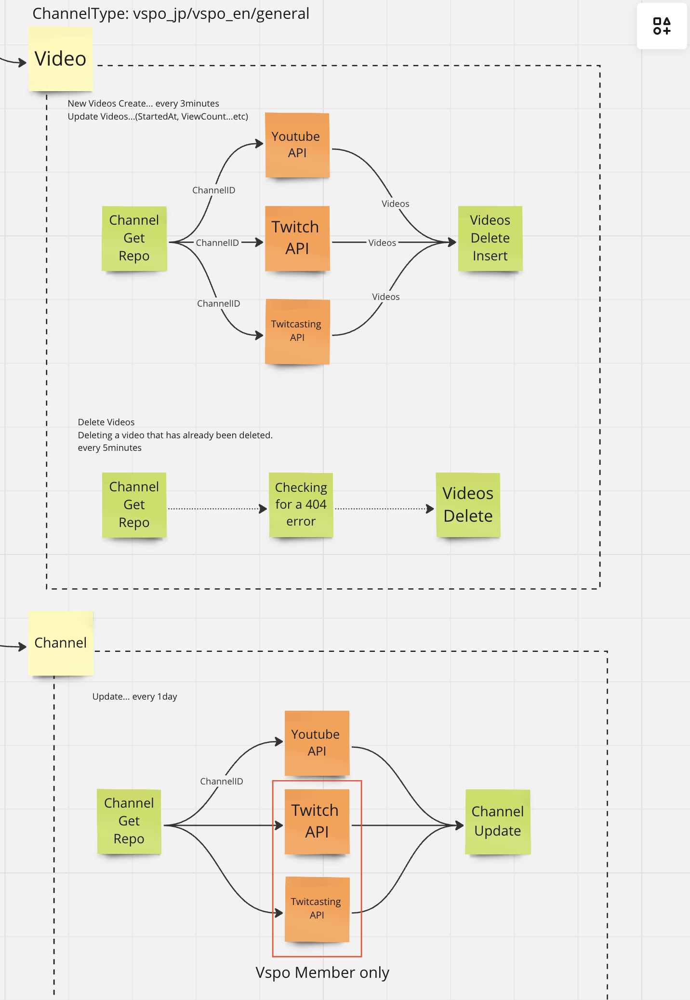

## Vspo Job Service

### Description
Youtube/Twitch/Twitcasting live stream update cron service.





### ER


### Getting Started

```bash
$ make local
# 8080: API
# 5432: Postgres
# Other: Migration

$ curl --location 'http://localhost:8080/cron/videos' \
--header 'Content-Type: application/json' \
--header 'Accept: application/json' \
--header 'x-api-key: {{apiKey}}' \
--data '{
  "platform_type": [
    "youtube"
  ],
  "period": "month",
  "video_type": "vspo_broadcast"
}'
```

### Endpoints

[OpenAPI](./docs/cron/openapi.yaml)
