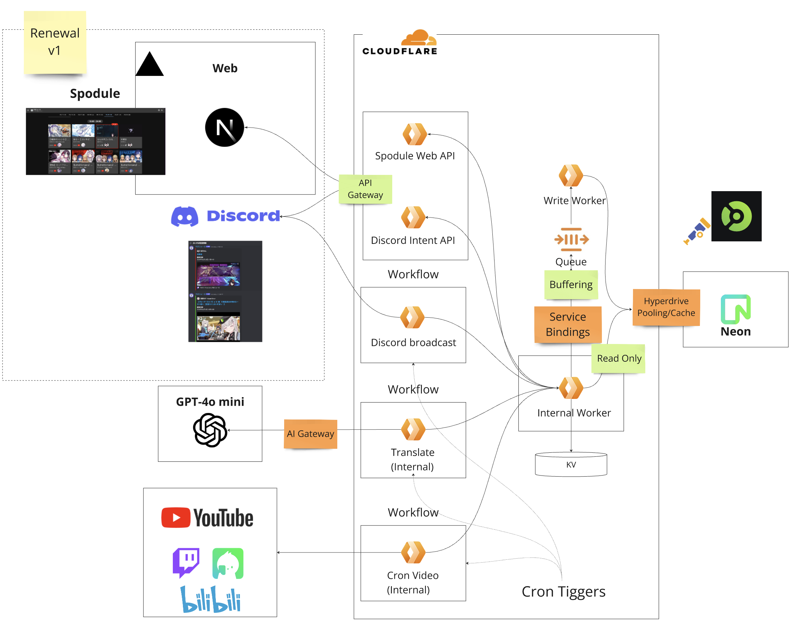

### Architecture Overview



### Setup

- copy env vars
```bash
for dir in config/wrangler/vspo-portal-gateway config/wrangler/vspo-portal-app config/wrangler/vspo-portal-cron; do cp .dev.example.vars "$dir/.dev.vars"; done
```

- install dependencies
```bash
pnpm i
```

- start db/otel collector
```bash
pnpm db:up
```

- migrate db
```bash
pnpm db:migrate
```

- start services (necessary to start as it aggregates processing for the internal app)
```bash
pnpm dev:internal # Must run
pnpm dev:gateway # API
pnpm dev:cron # For schedule verification
pnpm db:studio # Optional, allows browser access to DB contents
```

### Local Development

- Running Cron

Specify and run the set schedule
```bash
curl "http://localhost:3002/__scheduled?cron=*+*+*+*+*"
```

### Format
```bash
pnpm biome:check:write
```