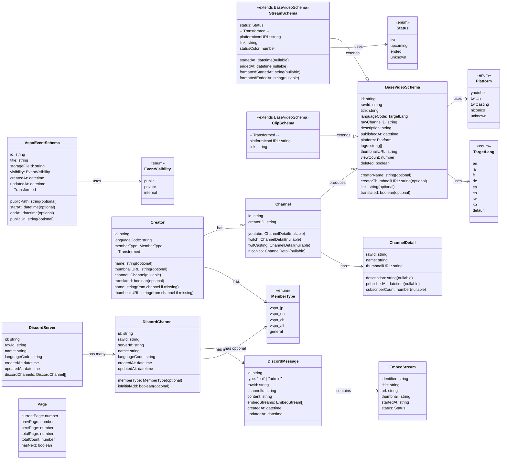

```mermaid
classDiagram
    direction LR

    class BaseVideoSchema {
        id: string
        rawId: string
        title: string
        languageCode: TargetLang
        rawChannelID: string
        description: string
        publishedAt: datetime
        platform: Platform
        tags: string[]
        thumbnailURL: string
        creatorName: string (optional)
        creatorThumbnailURL: string (optional)
        viewCount: number
        link: string (optional)
        deleted: boolean
        translated: boolean (optional)
    }

    class StreamSchema {
        <<extends BaseVideoSchema>>
        status: Status
        startedAt: datetime (nullable)
        endedAt: datetime (nullable)
        -- Transformed --
        platformIconURL: string
        link: string
        statusColor: number
        formattedStartedAt: string (nullable)
        formattedEndedAt: string (nullable)
    }

    class ClipSchema {
        <<extends BaseVideoSchema>>
        -- Transformed --
        platformIconURL: string
        link: string
    }

    class VspoEventSchema {
        id: string
        title: string
        storageFileId: string
        publicPath: string (optional)
        startAt: datetime (optional)
        endAt: datetime (optional)
        visibility: EventVisibility
        createdAt: datetime
        updatedAt: datetime
        -- Transformed --
        publicUrl: string (optional)
    }

    class EventVisibility {
        <<enum>>
        public
        private
        internal
    }

    class Platform {
        <<enum>>
        youtube
        twitch
        twitcasting
        niconico
        unknown
    }

    class Status {
        <<enum>>
        live
        upcoming
        ended
        unknown
    }

    class TargetLang {
        <<enum>>
        en
        ja
        fr
        de
        es
        cn
        tw
        ko
        default
    }

    class MemberType {
        <<enum>>
        vspo_jp
        vspo_en
        vspo_ch
        vspo_all
        general
    }

    BaseVideoSchema --> Platform : uses
    BaseVideoSchema --> TargetLang : uses
    StreamSchema --|> BaseVideoSchema : extends
    ClipSchema --|> BaseVideoSchema : extends
    StreamSchema --> Status : uses
    VspoEventSchema --> EventVisibility : uses

    Creator "1" -- "many" Channel : has
    Channel "1" -- "many" BaseVideoSchema : produces

    class Creator {
        id: string
        name: string (optional)
        languageCode: string
        memberType: MemberType
        thumbnailURL: string (optional)
        channel: Channel (nullable)
        translated: boolean (optional)
        -- Transformed --
        name: string (from channel if missing)
        thumbnailURL: string (from channel if missing)
    }

    class Channel {
        id: string
        creatorID: string
        youtube: ChannelDetail (nullable)
        twitch: ChannelDetail (nullable)
        twitCasting: ChannelDetail (nullable)
        niconico: ChannelDetail (nullable)
    }

    class ChannelDetail {
        rawId: string
        name: string
        description: string (nullable)
        thumbnailURL: string
        publishedAt: datetime (nullable)
        subscriberCount: number (nullable)
    }

    class DiscordServer {
        id: string
        rawId: string
        name: string
        languageCode: string
        createdAt: datetime
        updatedAt: datetime
        discordChannels: DiscordChannel[]
    }

    class DiscordChannel {
        id: string
        rawId: string
        serverId: string
        name: string
        languageCode: string
        memberType: MemberType (optional)
        isInitialAdd: boolean (optional)
        createdAt: datetime
        updatedAt: datetime
    }

    class DiscordMessage {
        id: string
        type: "bot" | "admin"
        rawId: string
        channelId: string
        content: string
        embedStreams: EmbedStream[]
        createdAt: datetime
        updatedAt: datetime
    }

    class EmbedStream {
        identifier: string
        title: string
        url: string
        thumbnail: string
        startedAt: string
        status: Status
    }

    class Page {
        currentPage: number
        prevPage: number
        nextPage: number
        totalPage: number
        totalCount: number
        hasNext: boolean
    }

    Channel --> ChannelDetail : has
    DiscordServer --> DiscordChannel : has many
    DiscordChannel --> DiscordMessage : has many
    DiscordMessage --> EmbedStream : contains
    Creator --> MemberType : has
    DiscordChannel --> MemberType : has optional
``` 